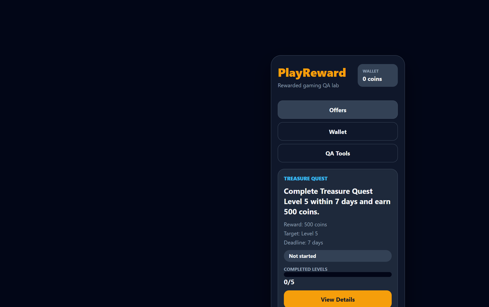
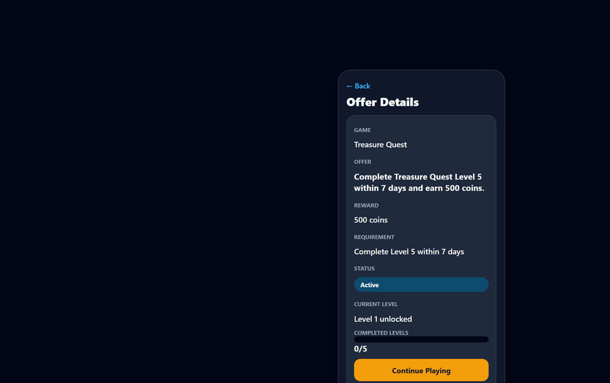
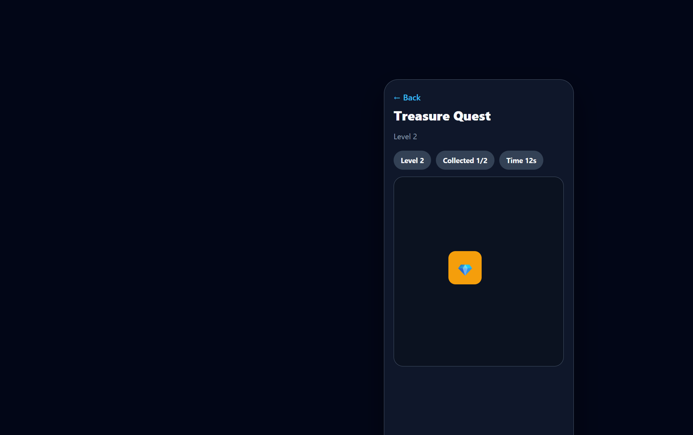
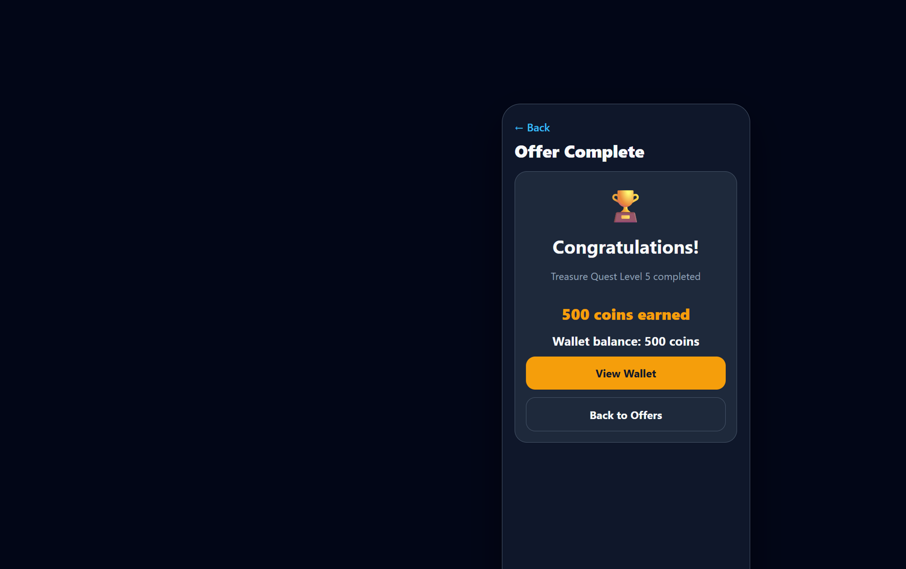
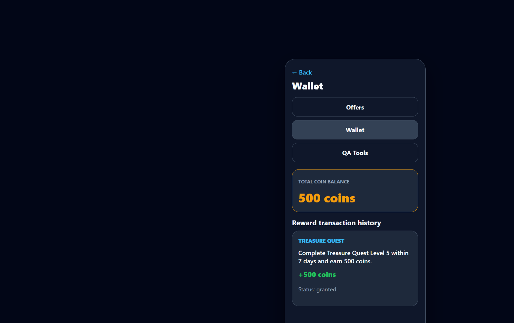
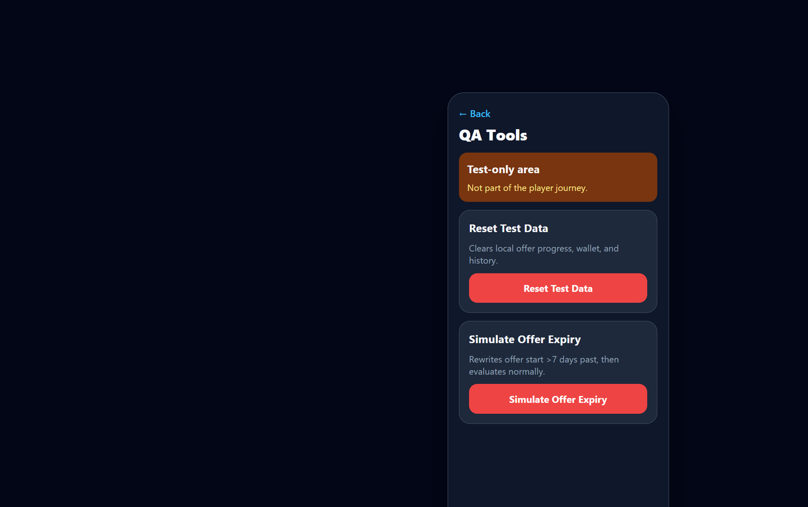

# PlayReward QA Lab

A minimal Expo React Native TypeScript app for testing a rewarded-gaming offer flow on a physical Android phone with Expo Go.

## Version 2 Scope

The fictional game is **Treasure Quest**. The offer is:

> Complete Treasure Quest Level 5 within 7 days and earn 500 coins.

Application areas:

1. **Offers** — PlayReward branding, wallet chip, Treasure Quest offer card
2. **Offer Details** — requirements, status, progress, Start / Continue
3. **Treasure Quest** — timed treasure-tap levels (1–5)
4. **Wallet** — coin balance and reward transaction history
5. **QA Tools** — test-only Reset Test Data and Simulate Offer Expiry

Version 1 was a single-screen prototype with a “Play Next Level” button. Version 2 keeps Expo SDK 54 and the same reward safeguards, but adds a multi-area journey and a small interactive challenge suitable for rewarded-gaming QA practice.

## Screenshots

Version 2 screen references (also in [`docs/screenshots/`](docs/screenshots/)):

| Screen | Preview |
| --- | --- |
| Offers |  |
| Offer Details |  |
| Treasure Quest |  |
| Completion |  |
| Wallet |  |
| QA Tools |  |

## Run With Expo Go

Requires Expo SDK 54-compatible dependencies (already pinned in `package.json`).

```powershell
npm install
npm start
```

Then open Expo Go on a physical Android phone and scan the QR code shown by Expo.

## Continue on another laptop

```powershell
git clone https://github.com/qunoot-ahmed/playreward-qa-lab.git
cd playreward-qa-lab
npm install
npm run lint
npm run typecheck
npx expo start
```

## Mobile Automation

A minimal Maestro suite covers four critical rewarded-gaming journeys (happy path, failure/retry, expiry protection, persistence/duplicate reward).

- Details, APK/EAS steps, and run commands: [`maestro/README.md`](maestro/README.md)
- Android application ID: `com.qunoot.playreward`
- Target: standalone EAS APK (not Expo Go)

```powershell
maestro test maestro/flows/
```

Do not treat automation as verified until those flows have been executed against an installed APK.

## Validation Commands

```powershell
npm run lint
npm run typecheck
```

## Important Files

- `App.tsx` — screen routing shell (no navigation library)
- `src/rewardRules.ts` — offer lifecycle, deadline, reward idempotency, attempt orchestration
- `src/gameRules.ts` — level treasure targets, 15s attempt duration, deterministic positions
- `src/storage.ts` — AsyncStorage load/save plus Version 1 → Version 2 migration
- `src/screens/` — Offers, Offer Details, Treasure Quest, Completion, Wallet, QA Tools
- `maestro/` — Maestro flows and subflows for critical journeys
- `eas.json` — EAS preview profile that produces an Android APK
- `docs/` — purpose, rules, flow, architecture notes, manual scenarios, journal, progress, prompts

## TestIDs

Stable test IDs cover main navigation, offer card/status, View Details, Start Offer, Continue Playing, progress values, current level, treasure target, collected count, remaining time, failure/retry, completion result, wallet balance, reward transaction rows, `reward-transaction-count`, QA Tools actions, and in-app confirm/cancel controls for reset and simulate expiry.